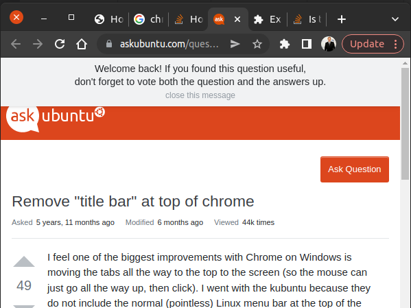

# Stack Overflow Banner Remover

I find this banner on StackExchange sites annoying:

This Chrome extension hides the banner.

It does it with very simple CSS, which is great. It probably won't fail. In fact the most likely fail is to work too well. Perhaps I should only hide the banner if it meets certain conditions, like if I know it's a banner that says "If you found this question useful". Or perhaps only if it has certain child elements in it. I think both of those require JavaScript. I did find [this page](https://stackoverflow.com/questions/1014861/is-there-a-css-parent-selector) which, as of late 2021/early 2022, mentions the upcoming :has() css pseudo element. But support is experimental so far. Anyway, since I think the CSS solution is good enough for now, I'll not go down the gold-plating route and call it a day.
